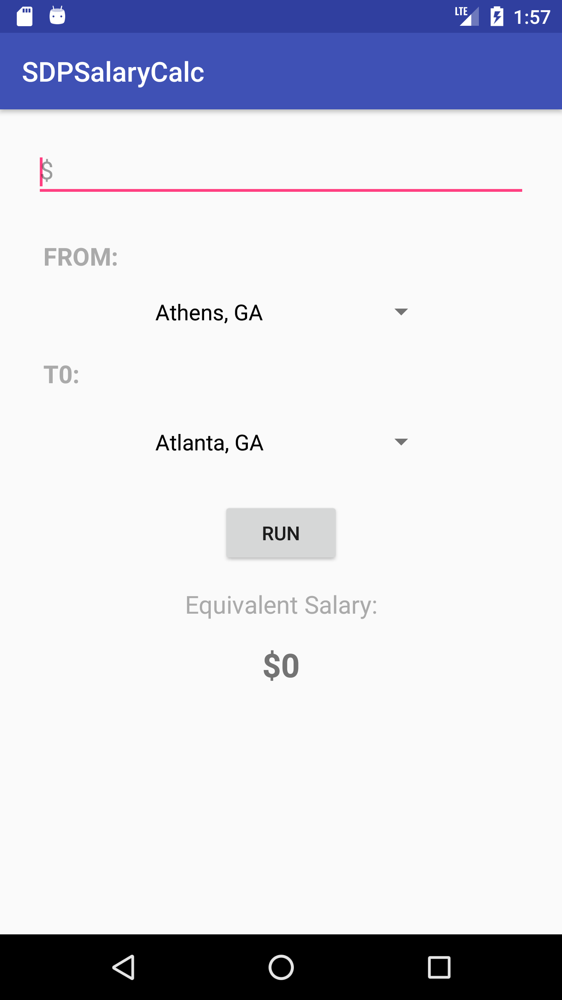
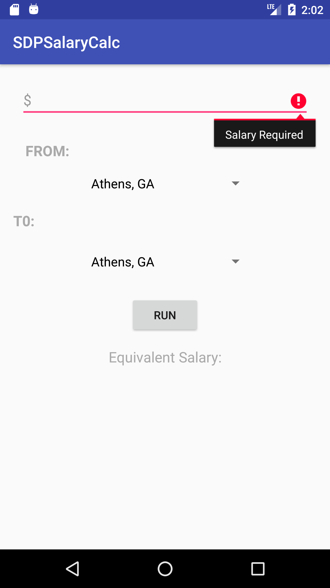
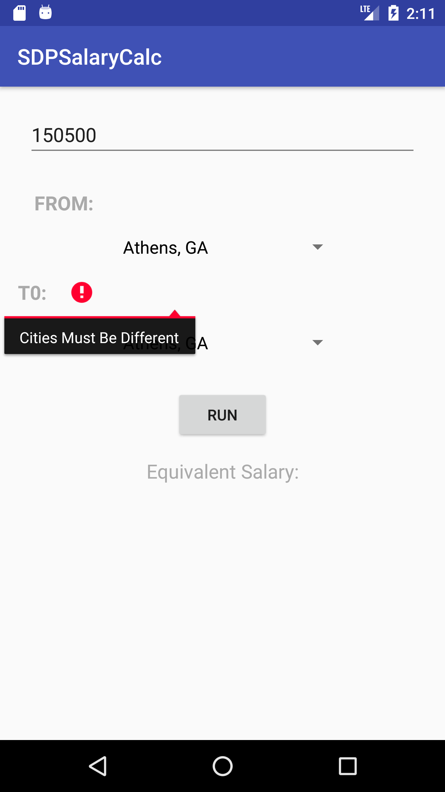
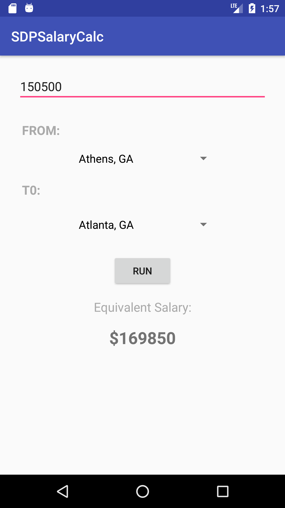

# Salary Calculator Android App

<div align="center">
    
    
    
     
</div>

## To Run

```
git clone git@github.gatech.edu:gt-omscs-se-2018summer/6300Summer18dfiedler3.git
```

Open ```Assignment4/SDPSalaryCalc``` as an existing project in Android Studio (with API23: Android 6.0 Marshmallow as minimum SDK)

Run on android emulator of your choice (screenshots are from Pixel XL)

## Resources
Assignment Documentation:[https://docs.google.com/document/d/1GYp7UrLkxHHCIw4TYOKh1wMRMBnTm188ZFSGC2oy3JU/edit](https://docs.google.com/document/d/1GYp7UrLkxHHCIw4TYOKh1wMRMBnTm188ZFSGC2oy3JU/edit)

Android Documentation: [https://developer.android.com/reference/](https://developer.android.com/reference/)

Please feel free to comment or fork this repo as needed.